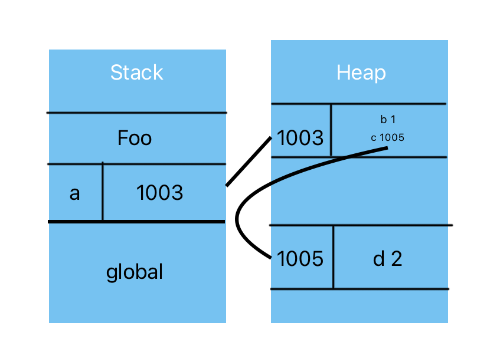

# Type

## Primary Types

- boolean
- string
- number
- null (It belongs to primary type, altough typeof null outputs 'object')
- undefined
- symbol
- bigInt
- object

## Subtype of Object

functions and arrays(note: low-case)

## Build-in Objects(other subtype of object)

- Boolean
- String
- Number
- Object
- RegExp
- Error
- Date

In js, they are actually build-in functions. They can be used as a constructor, with the result being a newly constructed object of the subtype.

```javascript
var strPrimitive = "I am a string";
typeof strPrimitive; // "string"
strPrimitive instanceof String; // false

var strObject = new String("I am a string");
typeof strObject; // "object"
strObject instanceof String; // true

// inspect the object sub-type
Object.prototype.toString.call(strObject); // [object String]
```

"I am a string" is a primitive literal and immutable value, that means you cannot directly modify its content, javascript automatically wrap the value in a temporay <mark>String</mark> object when performing operations on it, which it returns a new value not modify itself.

## How to check data type of a variable

- Basic types: Use typeof.
- Using instanceof
- Distinguishing objects (like array or date): Use Object.prototype.toString or specific checks like Array.isArray.
- Using isNaN or Number.isNaN

---

# Contents

Contents which implies that these values are actually stored inside the object, that's merely an appearance. The engine stores value in implementation-dependent ways, and may very well not store in some object container. What is stored in the container are these properties name, which act as reference.

```javascript
function foo() {
  var a = { b: 1, c: { d: 2 } };
}
foo();
```

<center></center>

## Methods

Methods don't belong to objects, and they are just references to the method. There's nothing special (outside of possible implicit this binding is distinct between method and functions at call-site)

# Duplicating Objects

The first thing we need to consider is a shallow or deep copy.

- A shallow copy shares references for nested objects.
- A deep copy ensures that the copied object and its nested structures are fully independent of the original object.

## Shallow Copy

A shallow copy creates a new object and copies the top-level properties of the original object to the new object.
If those properties are primitive values (e.g., strings, numbers), they are directly copied.
However, if those properties are references to other objects or arrays, the shallow copy will only copy the reference, not the actual nested object. This means both the original and the copied object will share the same referenced object.

## Deep Copy

A deep copy creates a completely new object, including all nested objects or arrays.
This means the copied object is entirely separate from the original object, with no shared references. Changes in one will not affect the other.

# Questions

1. Why **delete** could effect performance
